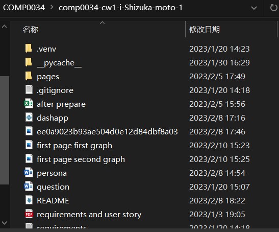
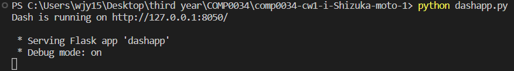
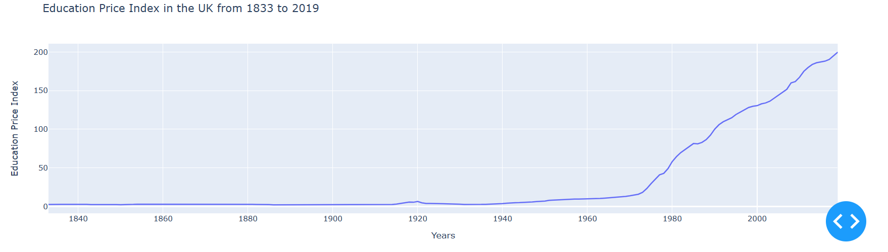
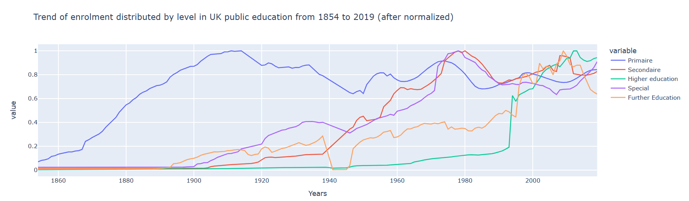
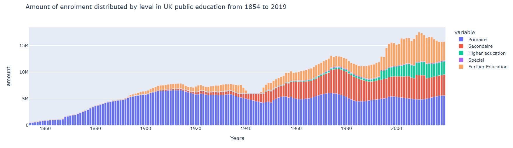
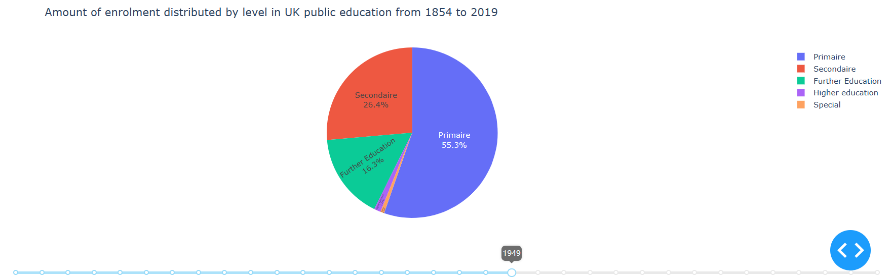
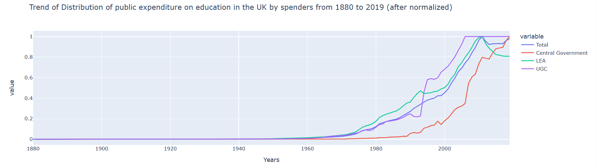
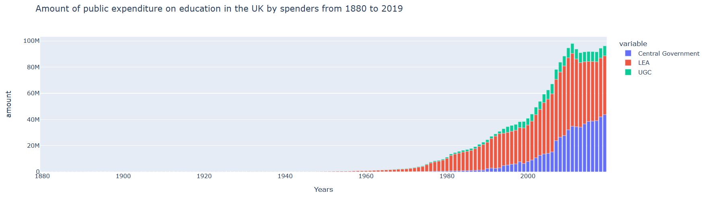
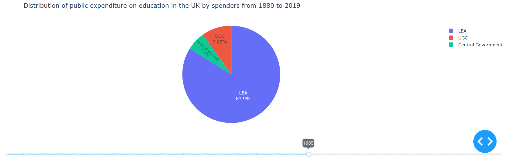
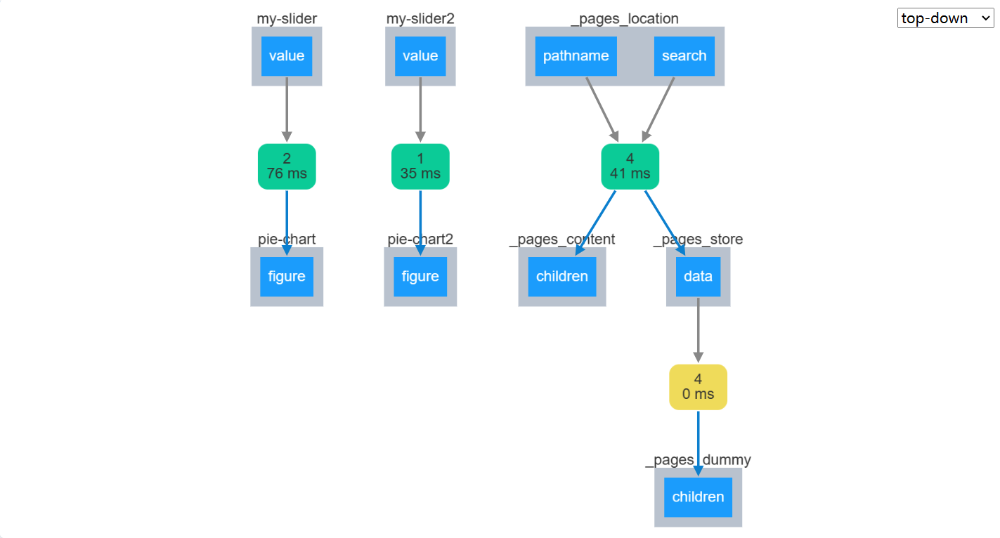

# COMP0034 Coursework 1 template repository
URL to your GitHub repo: https://github.com/ucl-comp0035/comp0034-cw1-i-Shizuka-moto.git
# Set-up instructions
All function packages were preinstalled.
1. Open the repository folder (in this case, "comp0034-cw1-i-Shizuka-moto-1") in Visual Studio Code.

2. To run the dash app, simply type "python dashapp.py" in the terminal. Then open the link provide by terminal.

3. There would be a navigate bar on the top of page, single click on the dataset you need./
   In second and third page of dash app, there's a slider using callback for user to go through specific year of data.
# Visualisation design
        Joan's question and my solution:

1: Make the app easy to use. Since not all of the citizens an expert in computer engineering。

Solution: Create a multipage dash app for data visualization, user could simply click and scroll the page and slider for different data set.

2: Since we provide you three sheets of data and to make the page better to use. Please design the page in a well organize way.

Solution: Create multipage dash app to well display different dataset. Allocate each dataset a page to display information.

3: For enrolment and institution distribution dataset, we need to change our policy for different enrolment level of students and institutions. So, we want visualization of changing of different institutions in percentage and .

Solution: Create callback function to display data of these sheet in specific year (pie chart). For example, using a slider for choosing specific year of data.

4: For expenditure dataset, show the trend of inflation rate and constant price 1990 separately. The government need that for designing new economic policy.

Solution: Use bar line chart to display the trend.

5: For enrolment dataset, we need to reallocate the support policy for different level of enrolment. In this case, we need the trend of every dataset.

Solution: Use line chart to display the trend (normalize data), also plot bar chart to display the percentage of every level of enrolment occupied (without normalizing).

6: For institutional spending dataset, to quantify the spending by different institutions. Show the trend of different institutions. 

Solution: Use line chart to display the trend (normalize data), also plot bar chart to display the percentage of every institution occupied (without normalizing).

        visualization design:

Public expenditure on education in the UK (1833-2019) page:
first graph: Since we only have one column of relative data, plot it without normalization.

second graph: Since we only have one column of relative data, plot it without normalization.

Enrolment distributed by level in UK public education (1854-2019) page:
first graph: Since Joan want the comparison of different level of enrolment,
line chart after normalized would be the best choice in this case[1]. Cause after normalize, the magnitude of
data could be ignored. We only focus on the trend of every line. Which means the trend is been enhanced. By single click on the legend next to graph, user can hide or show specific line. And double click for highlight.

second graph: In order to illustrate the occupation of every institutions in specific year to Joan, using bar chart is the best choice in this case[1]. User
would know which level of enrolment has the largest population directly. Get the data of specific level in specific year with just 
put mouse on graph. By single click on the legend next to graph, user can hide or show specific line. And double click for highlight.

Third graph: Joan wants to view data by specific year, and want to know the change in percentage of data. In this case, create a 
slider through callback function. User could choose specific year data, in this case the percentage of every level of enrolment 
becomes quiet clear now. The trend is clear if user slide the slider. By single click on the legend next to graph, user can hide or show specific data.

Distribution of public expenditure on education in the UK by spenders (1880-2019) page:
first graph: Since Joan want the comparison of different institutions data, line chart after normalized would be the best choice in this case[1]. Cause after normalize, the magnitude of data could be ignored. We only focus on the trend of every line. Which means the trend is been enhanced. By single click on the legend next to graph, user can hide or show specific line. And double click for highlight.

second graph: In order to illustrate the occupation of every institutions in specific year to Joan, using bar chart is the best choice in this case[1]. User
would know which level of enrolment has the largest population directly. Get the data of specific level in specific year with just 
put mouse on graph. By single click on the legend next to graph, user can hide or show specific line. And double click for highlight.

Third graph: Joan wants to view data by specific year, and want to know the change in percentage of data. In this case, create a 
slider through callback function. User could choose specific year data, in this case the percentage of every institutions 
becomes quiet clear now. The trend is clear if user slide the slider. By single click on the legend next to graph, user can hide or show specific data.

    reference:
[1] How to choose the best chart or graph for your data | google cloud blog (no date) Google. Google. Available at: https://cloud.google.com/blog/products/data-analytics/different-types-graphs-charts-uses (Accessed: February 8, 2023). 
# Dash app

Use multipage method to separate three sheets into three pages, meet Joan's requirements of well organised.
Use navigate bar to show the link for three pages.
Use external_stylesheets=[dbc.themes.BOOTSTRAP] method to give dash app ability of display on different size of page

Public expenditure on education in the UK (1833-2019) page:
first graph: Simply use plotly express method for graph.
second graph: Simply use plotly express method for graph.

Enrolment distributed by level in UK public education (1854-2019) page:
first graph: Using "for column in ennn.columns:
                  ennn[column] = ennn[column]  / ennn[column].abs().max()
              ennn['Years'] = enn['Years']" to normalize data. Then use plotly express to plot line chart.

second graph: Simply use plotly express method for graph. But include several colums of data which display them into one chart.

Third graph: Using "enn_t = ennnn[['Primaire','Secondaire','Higher education ','Special','Further Education']]
                    enn_t = enn_t.T" 
             First delete "total" column in dataset then do transpose for data in order to plot pie chart.
             Finally write callback code and slider code for user to interact with app:"@callback(
                                                                                        Output(component_id='pie-chart', component_property='figure'),
                                                                                        Input(component_id='my-slider', component_property='value'))"
             Here slider is input and pie chart is output, then we apply a update graph code:"def update_graph(input_value):
                                                                                              fig1 = px.pie( enn_t, values = input_value - 1854, names = ['Primaire','Secondaire','Higher education ','Special','Further Education'], title="Amount of enrolment distributed by level in UK public education from 1854 to 2019",)fig1.update_traces(textposition='inside', textinfo='percent+label')
                                                                                              return fig1"

Distribution of public expenditure on education in the UK by spenders (1880-2019) page:
first graph: Using "for column in insss.columns:
                        insss[column] = insss[column]  / insss[column].abs().max()
                    insss['Years'] = inss['Years']" to normalize data. Then use plotly express to plot line chart.

second graph: Simply use plotly express method for graph. But include several colums of data which display them into one chart.

Third graph: Using "inssss_t = inssss[['Central Government','LEA','UGC']]
                    inssss_t = inssss_t.T" First delete total column in dataset then do transpose for data in order to plot pie chart.
             Write callback code:"@callback(
                                  Output(component_id='pie-chart2', component_property='figure'),
                                  Input(component_id='my-slider2', component_property='value'))"
             In this case, slider input the specific year and pie chart is output.
             Finally finish update graph code: "def update_graph(input_value):
                                                    fig1 = px.pie(inssss_t,values = input_value - 1880,
                                                    names = ['Central Government','LEA','UGC'],
                                                    title="Distribution of public expenditure on education in the UK by spenders from 1880 to 2019",)
                                                    fig1.update_traces(textposition='inside', textinfo='percent+label')
                                                    return fig1"